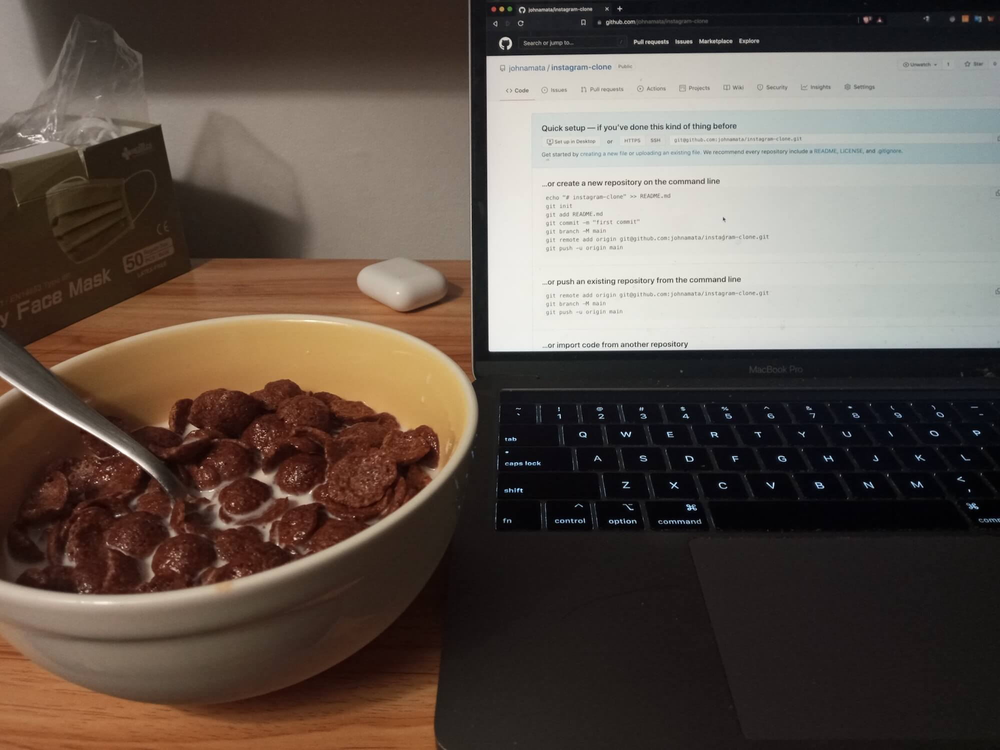

# get skilled

It's 2021-10-15. Just a few minutes passed midnight and I'm sitting on a dim lit room with a bowl of milk and Koko Krunch chocolate cereals by my macbook. I was about to sleep, watch a TV show or two at netflix before turning off the lampshade and hit the bed. But I remembered that I havent done anything productive yesterday. Didnt spend at least 30 minutes bettering myself, and that's not how you win. It's time to get skilled bros LEZGO



# notes

### start creating a next.js project with tailwindcss

from: https://tailwindcss.com/docs/guides/nextjs

```
npx create-next-app -e with-tailwindcss my-project
cd-project
```

### pages

where to put our pages, ex. index.js -> index.html, about.js -> about.html

### components

components directory where i put stuff like header, feed, and other components

### _rfce

type _rfce then hit return/enter on VS code, needs the es7 react/redux/graphql/react-native snippets. creates a react functional export component, for example for components/header.js it generated:

```javascript
function Header() {
    return (
        <div>
            
        </div>
    )
}

export default Header
```

### ctrl + space

finds path for import for VS Code, like typing  on the index.js the header component

```javascript
<Header/>
```

then hitting enter/return will show up the path for you to import with, then i can just hit enter and it'll generate an import for it at the top

```javascript
import Header from '../components/Header'
```